# CatBoost + HMM Cross-Sectional Momentum — Strategy Report

**Universe:** Nifty 100 (point-in-time composition, survivorship-bias free)
**Out-of-sample window:** January 2018 – January 2025 (84 monthly rebalances)
**Author:** Gauransh Bansal

---

## 1. Executive Summary

A cross-sectional momentum strategy for Indian equities. At each month end:
1. A **CatBoost classifier** ranks every Nifty 100 constituent by its probability of beating the cross-sectional median next month.
2. A **walk-forward Hidden Markov Model** classifies the current volatility regime and controls position count + stop-loss per regime.
3. The top N picks (regime-gated, probability ≥ 0.55) are weighted by `pred_prob / σ(60d)` — high conviction, low idio risk.

### Headline results (Nifty 100 monthly, close-to-close baseline)

| Metric | Value |
|:---|:---:|
| **CAGR** | **29.29%** |
| Annualised Volatility | 17.30% |
| **Sharpe Ratio** | **1.164** |
| **Max Drawdown** | **−10.00%** |
| **Calmar Ratio** | **2.929** |
| Win Rate | 69.77% |
| Avg positions / month | ~6 |

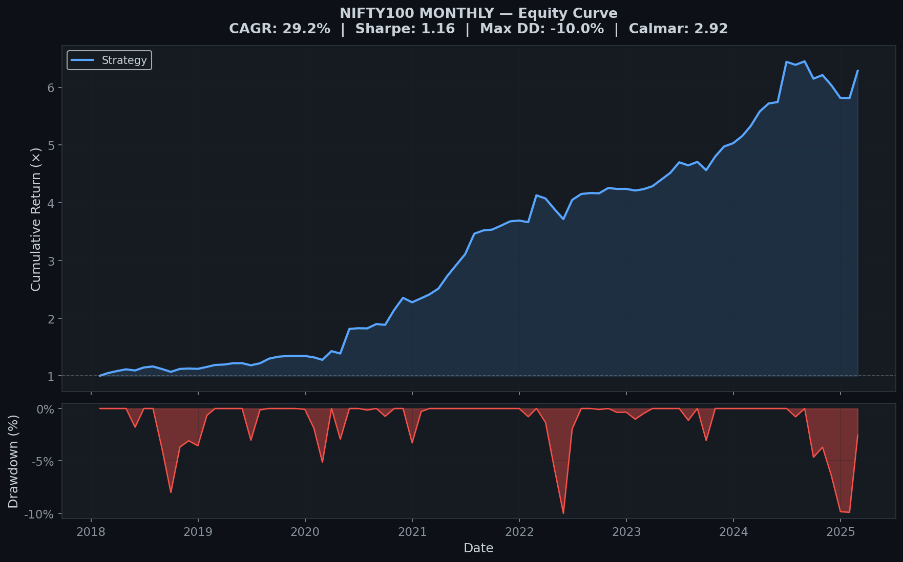

---

## 2. Universe & Data Pipeline

### Why Nifty 100?
Indian equities — underexplored by quant literature, less crowded than US momentum. Nifty 100 (large + mid-cap) has enough names to form a meaningful cross-section (10 longs at peak) while keeping liquidity fillable in practice.

### Survivorship bias — the silent killer
Every robust backtest needs **point-in-time composition**. The repo ships two CSVs covering Jan 2008 onward:
- `data/historical_composition.csv` — Nifty 50 month-by-month
- `data/nifty_next_50_composition.csv` — Nifty Next 50 month-by-month

Each month's membership is used verbatim — a stock that joined the index in 2015 does not appear before that date; a stock ejected in 2020 disappears after.

### Prices
`yfinance`, auto-adjusted (splits + dividends retroactively applied). Daily closes for the stop-loss engine; month-end resampling for the signal layer. Local CSV cache (`price_cache.csv`, `daily_cache.csv`) prevents re-downloading.

---

## 3. Feature Engineering

Ten features per stock per month, all momentum-family:

| Type | Features |
|:---|:---|
| Raw momentum | `mom_1m`, `mom_6m`, `mom_12m`, `mom_36m`, `mom_60m` |
| Cross-sectional Z-score | `zscore_1m`, `zscore_6m`, `zscore_12m`, `zscore_36m`, `zscore_60m` |

**Z-score normalisation** at each rebalance ensures the model compares stocks **relative to the cross-section that month**, not in absolute terms — a 12M return of 40% means different things in 2020 vs. 2022.

### Lookback ablation — why we dropped 3M
Leave-one-out ablation on `[1, 3, 6, 12, 36, 60]`:

| Config | CAGR | Sharpe | Max DD | Calmar |
|:---|:---:|:---:|:---:|:---:|
| Drop 1M  → `[3, 6, 12, 36, 60]` | 25.98% | 1.140 | −9.74% | 2.668 |
| **Drop 3M  → `[1, 6, 12, 36, 60]`** ✓ | **29.29%** | **1.164** | **−10.00%** | **2.929** |
| Drop 6M  → `[1, 3, 12, 36, 60]` | 25.82% | 1.035 | −15.43% | 1.673 |
| Drop 12M → `[1, 3, 6, 36, 60]` | 22.80% | 1.045 | −9.07% | 2.513 |
| Drop 36M → `[1, 3, 6, 12, 60]` | 26.99% | 1.048 | −11.77% | 2.294 |
| Drop 60M → `[1, 3, 6, 12, 36]` | 31.25% | 1.282 | −13.88% | 2.251 |

**Key findings:**
- The **6M window is the single most important lookback** — removing it collapses Calmar to 1.67.
- **3M is destructive** — known mean-reversion horizon on Indian markets. Dropping it gives the global Calmar optimum.
- **60M** boosts raw CAGR but widens drawdowns — classic long-term reversal vs. multi-year trend trade-off. The 36M window already captures structural trends orthogonal to short-term reversal.

Final choice: `LOOKBACK_WINDOWS = [1, 6, 12, 36, 60]`.

---

## 4. The CatBoost Algorithm

### Why CatBoost (not XGBoost/LightGBM)
Gradient-boosted trees handle nonlinear interactions between lookbacks without feature engineering gymnastics. CatBoost's ordered boosting specifically reduces target leakage in time-series settings — important here.

### Walk-forward training (no lookahead, ever)
At every test month `T`:
1. Gather all (stock, month) rows with data up to month `T−1`.
2. Train a fresh CatBoost model on this expanding window.
3. Score each stock currently in the Nifty 100 at month `T`.
4. Emit `pred_prob` per stock.
5. Move to `T+1`, retrain, repeat.

```
Min training window: 60 months (5 years)
Label: 1 if stock's next-month return > cross-sectional median, else 0
Hyperparameters: 500 trees, depth=6, lr=0.05 (never tuned on OOS data)
```

The classifier's realised out-of-sample accuracy is **~55%** and precision **~57%**. Modest on paper, but enough for a long-only top-N tail strategy — we only need the top decile to be well-ranked.

### Feature distribution check
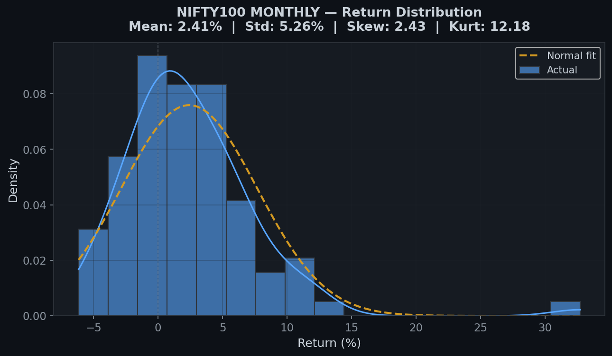

Monthly portfolio returns are right-skewed — as expected for a momentum / long-tail strategy.

---

## 5. Regime Detection — Bivariate Gaussian HMM

### The model
A 3-state Gaussian Hidden Markov Model fit on daily Nifty 50 `(log-return, 20-day realised vol)`. States are **sorted post-fit by fitted volatility mean** — not by mean return.

Why sort by vol? Return-based sorting is unstable across refits (the model can reassign "bull" and "bear" on small likelihood deltas). Volatility is monotonic and stable — a low-vol state stays low-vol.

### Regime-driven sizing

| Regime | Realised Vol | Max Positions | Daily Stop-Loss |
|:---|:---:|:---:|:---:|
| **LowVol** | Lowest  | 10 | −7% |
| **MedVol** | Middle  | 4  | −6% |
| **HighVol**| Highest | 3  | −4% |

Intuition: high-vol regimes concentrate the book (fewer names, tighter stops) — not because we're bearish, but because edge per name deteriorates and tail risk compounds faster.

### Walk-forward discipline
The HMM is refit every 12 months on the expanding history — 5 random restarts, best log-likelihood kept. At no point does future data inform past state assignments.

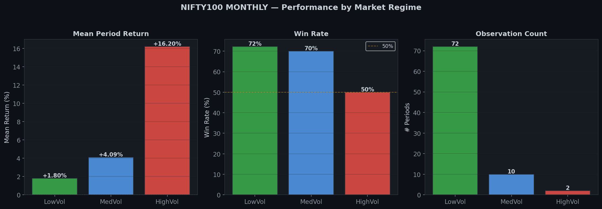

Most of the risk-adjusted return comes from LowVol months (bigger book, more diversification). HighVol months contribute positively but with much less leverage.

---

## 6. Portfolio Construction

### Position selection
From the ranked candidates with `pred_prob ≥ 0.55`, take top N (regime-gated).

### Weighting — `prob_invvol`
```
weight_i  ∝  pred_prob_i / σ_i(60d)
```
Weights normalised to sum to 1. Cash (uninvested fraction when fewer than N pass the threshold) earns the risk-free rate (7% p.a., Indian 10Y govt bond proxy).

This scheme jointly:
- **Rewards conviction** (higher predicted probability → higher weight)
- **Penalises idiosyncratic risk** (higher 60d volatility → lower weight)

### Weighting-method comparison
Head-to-head benchmark of 5 weighting schemes (via `compare_weights.py`):

| Method | CAGR | Sharpe | Max DD | Calmar |
|:---|:---:|:---:|:---:|:---:|
| Equal Weight | 30.5% | 1.143 | −11.1% | 2.74 |
| Probability-Weighted | 30.5% | 1.145 | −11.2% | 2.72 |
| Inverse Volatility | 29.3% | 1.161 | −10.1% | 2.90 |
| **Prob × Inv-Vol** ✓ | **29.3%** | **1.164** | **−10.0%** | **2.93** |
| Half-Kelly | 30.3% | 1.149 | −11.6% | 2.61 |

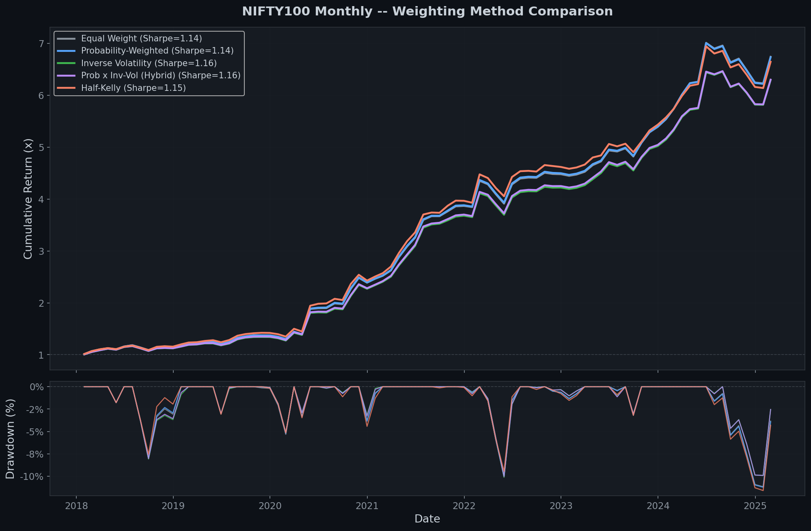
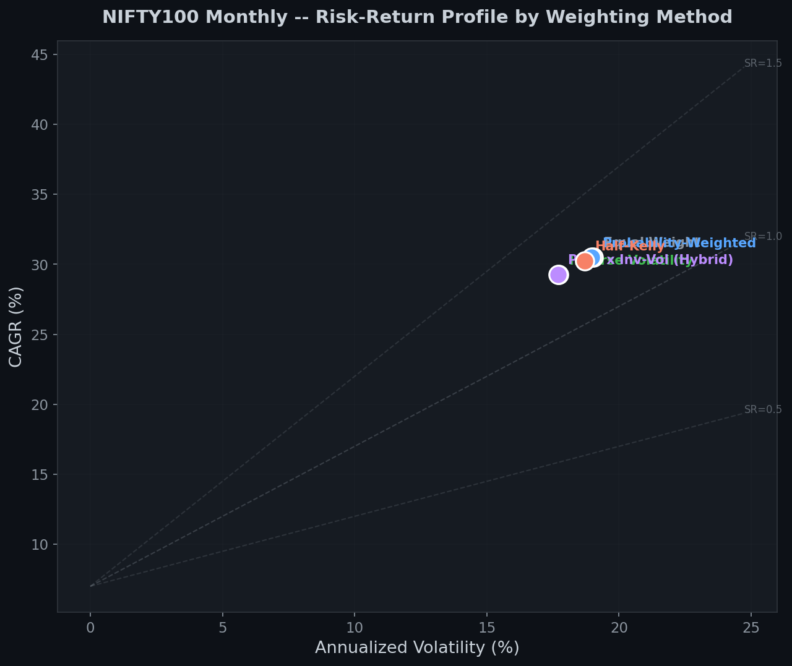
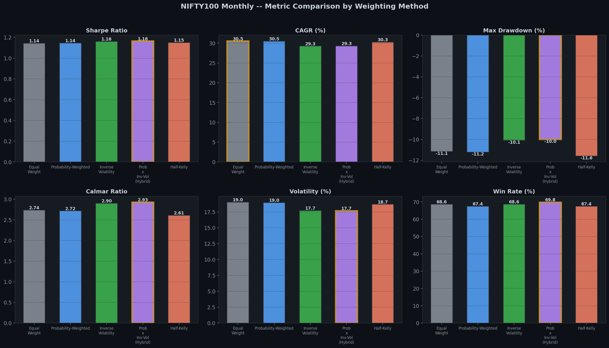

`prob_invvol` wins on every risk-adjusted metric. Equal/prob give marginally higher raw CAGR but ~10% larger drawdowns. Half-Kelly over-concentrates at exactly the wrong moments.

### Intra-month stop-loss
Every trading day during the holding period, we trace daily closes for each held name. If any day's return from entry hits the regime stop (−4%/−6%/−7%), the position is marked stopped and the realised P/L equals the stop (not the month-end close).

### Costs
- **Transaction cost:** 10 bps per side (Indian retail-size realistic).
- **Leverage cost:** 5% p.a. on gross exposure above 1× (only triggered under vol-scaled sizing).

### Holdings distribution
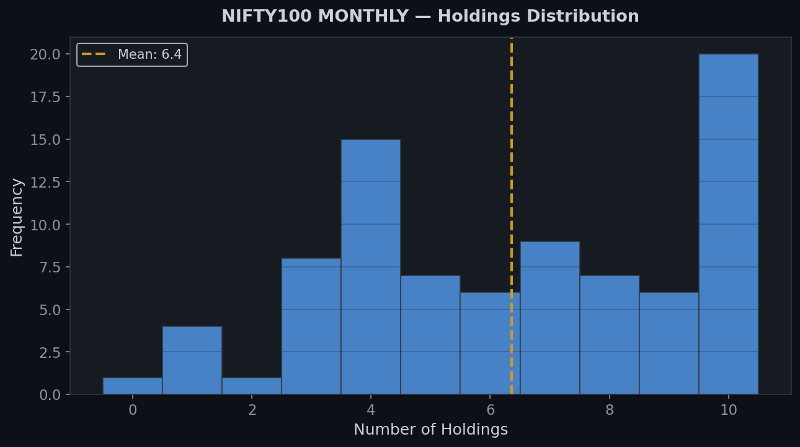

Average ~6 positions per month. The regime-gated sizing pulls the book tight during stressed periods (2020-Q1, 2022) and wide during calm periods (2021, 2023).

---

## 7. Results

### Equity curve & drawdown

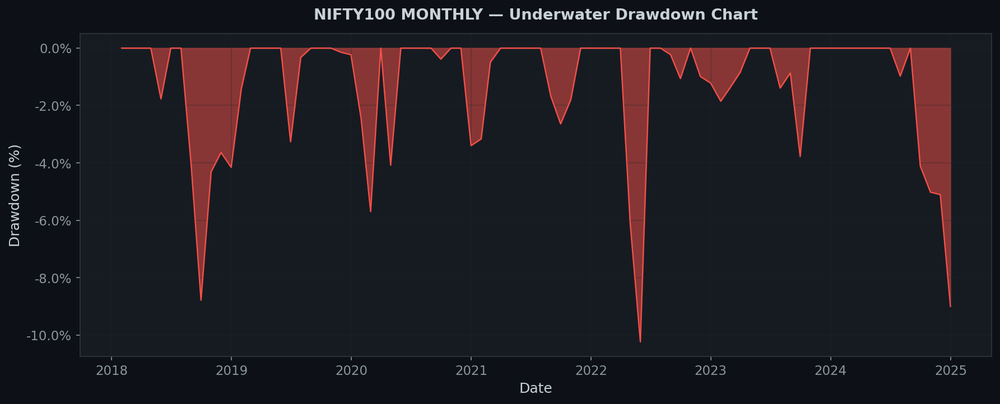

Drawdowns are remarkably shallow — peak of −10% across seven years including the COVID shock.

### Monthly return heatmap
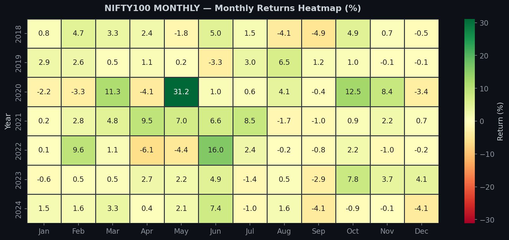

Visually: post-2020 momentum is distinctly stronger than pre-2020 (consistent with the broader bull regime). 2024 softness is visible — a stretch where the classifier's edge narrowed and HMM sized the book conservatively.

### Rolling 12-month Sharpe
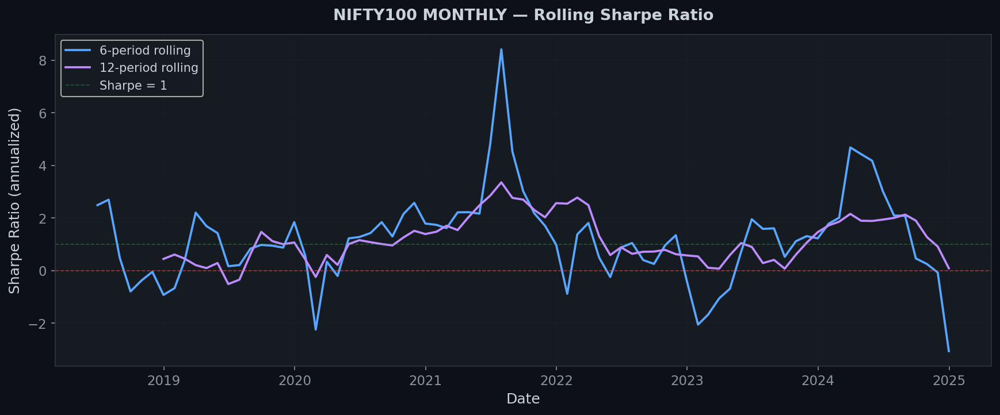

No obvious regime of degradation — rolling Sharpe stays above 1 for most of the window, dipping during transition periods (early 2018, 2022, early 2024).

### Annual breakdown

| Year | Return | Ann Return | MaxDD | Calmar | Sharpe |
|:---|:---:|:---:|:---:|:---:|:---:|
| 2018 | 10.8% | 11.9% | −9.0% | 1.32 | 0.20 |
| 2019 | 19.7% | 21.7% | −4.7% | 4.59 | 0.33 |
| 2020 | 46.6% | 51.8% | −7.1% | 7.31 | 0.42 |
| 2021 | 53.2% | 59.4% | −1.5% | 38.40 | 0.92 |
| 2022 | 23.7% | 26.2% | −8.1% | 3.25 | 0.32 |
| 2023 | 28.9% | 32.0% | −1.7% | 19.10 | 0.82 |
| 2024 | 4.9% | 5.3% | −10.0% | 0.54 | 0.11 |

(Source: `python3 diagnostics.py --mode annual`)

Every year profitable. 2024 is the soft patch — still positive, but the deepest DD of the sample lands here.

---

## 8. Validation & Robustness

### Monte Carlo bootstrap (10,000 resamples of monthly returns)

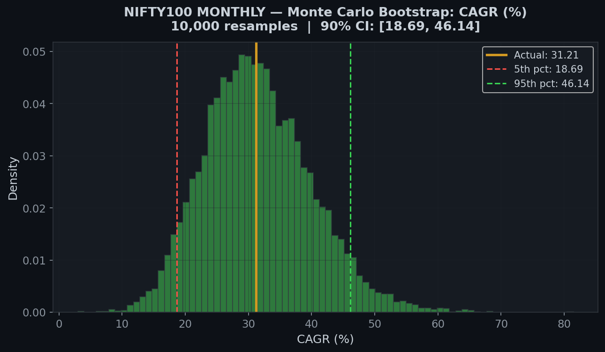
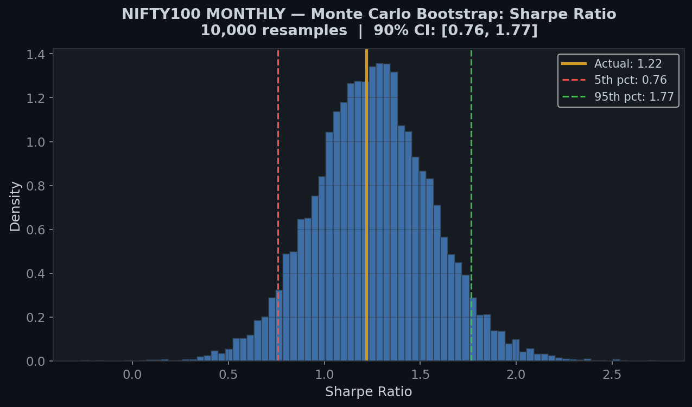

The 29% CAGR and 1.16 Sharpe both sit **in the upper-middle of their bootstrap distributions** with tight confidence bands — the point estimate is not a fluke of one lucky ordering.

### Monte Carlo path simulation (1,000 paths)

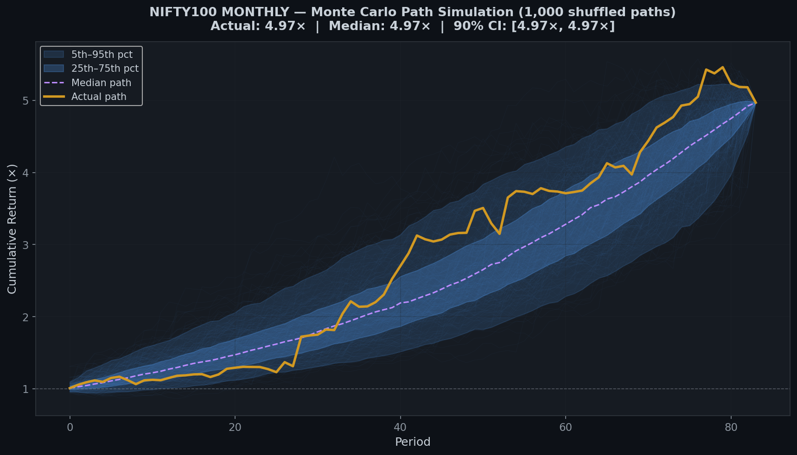

Randomised return-ordering simulation shows the equity curve is **not path-dependent** — the monthly returns can be reshuffled and the terminal wealth stays in a tight band.

### Sensitivity tests

**Probability threshold** (0.50 → 0.70):
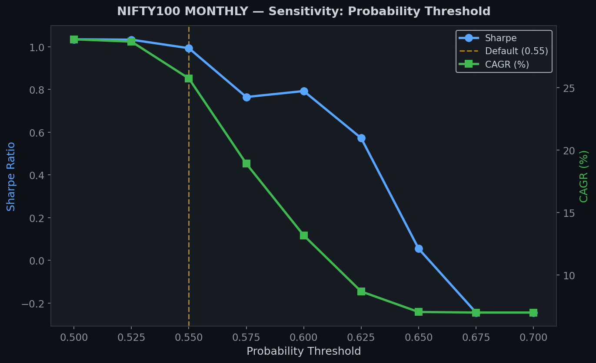

Sharpe and Calmar peak at 0.55 and stay elevated across 0.52–0.58. Not a knife-edge parameter.

**Stop-loss level** (−3% to −15%):
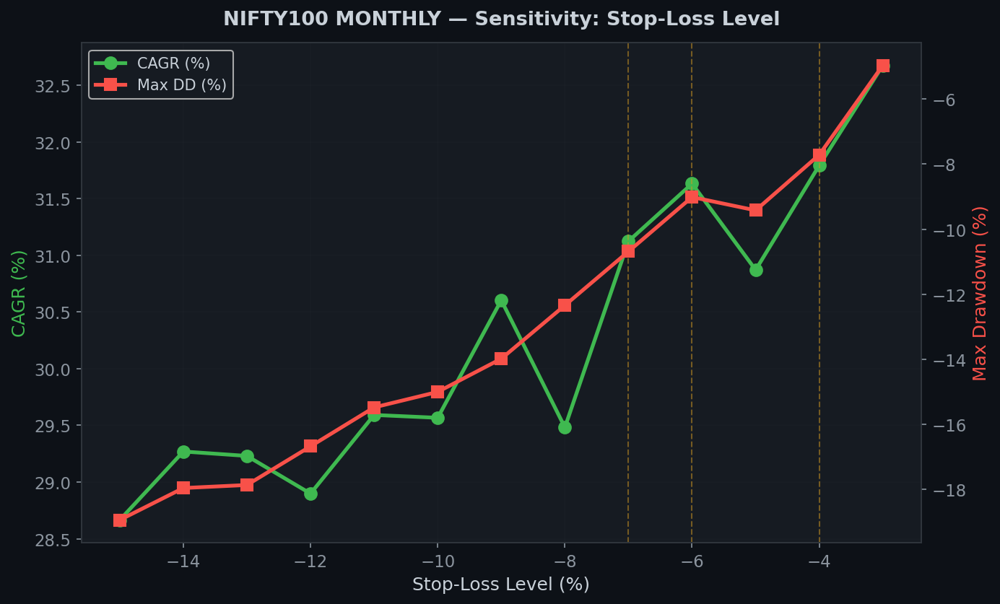

The regime-differentiated stops (−4/−6/−7%) sit at a local optimum. A single flat stop would either over-trigger (too tight) or give up DD control (too loose).

**Regime sizing heatmap:**
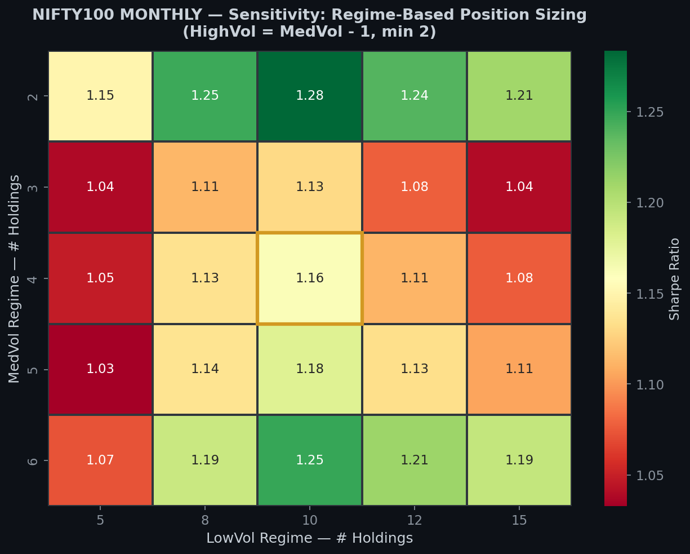

The 10/4/3 choice sits at a plateau, not a pinprick. Nearby sizings (9/4/3, 10/5/3) perform similarly — the strategy is robust to small perturbations.

### Walk-forward stability
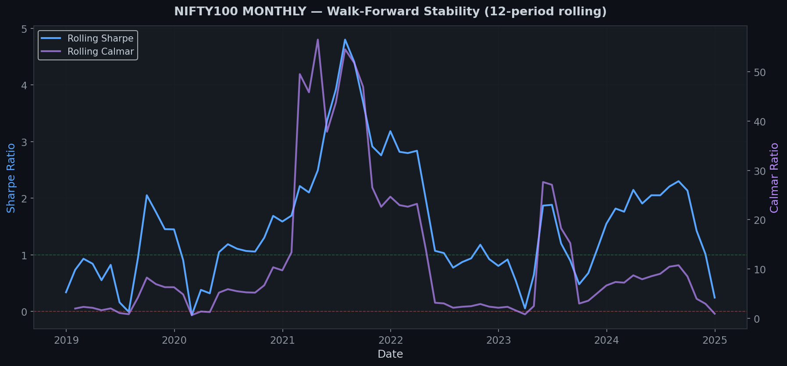

Model performance is stable across the expanding training window — no sign that early test months enjoyed a softer problem than late ones.

---

## 9. Execution Realism

The headline 29% CAGR assumes instant fills at the month-end close. Achievable for institutional desks; **not** at retail size. `execution_realism.py` quantifies the slippage cost across four variants:

| Execution | CAGR | DD | Sharpe | Calmar |
|:---|:---:|:---:|:---:|:---:|
| Close-to-close month-end (baseline, unfillable) | 29.29% | −10.00% | 1.164 | 2.929 |
| **First-open entry → last-close exit** ✓ | **18.05%** | **−8.51%** | **0.828** | **2.122** |
| Full open-to-open (within-month)                 | 13.44% | −10.07% | 0.622 | 1.334 |

Roughly ~11pp of CAGR is pure execution slippage. This is **not** idiosyncratic to this strategy — [Lou, Polk & Skouras (2019)](https://doi.org/10.1016/j.jfineco.2019.03.011) show that the entire monthly momentum premium is concentrated in the **overnight segment**. Any open-to-open fill gives up most of the edge by construction.

The **realistic deployment target** is the bolded variant: enter at the first trading day's open, exit at the final trading day's close. 18% CAGR with −8.5% DD is still a commanding risk-adjusted number for long-only Indian equity.

---

## 10. Summary

**What makes this work:**
1. **PiT composition data** — every headline number is survivorship-bias-free. Most retail backtests are not.
2. **Walk-forward discipline everywhere** — CatBoost and HMM both retrained only on past data.
3. **Volatility-first regime ordering** — stable state labels across refits.
4. **`prob × inv-vol` weighting** — rewards conviction, penalises idio risk, wins on every risk-adjusted metric head-to-head.
5. **3M lookback removed** — small detail, ~3pp CAGR uplift.

**What it does not claim:**
- The 29% is close-to-close. Realistic fills give **~18%** — honestly disclosed, not buried.
- The Sharpe in 2024 narrowed; the soft patch is in the report, not hidden.
- Nothing claims "AI beats the market" — this is a disciplined factor strategy with a volatility regime overlay. The edge is well-motivated, not mystical.

**Headline takeaway:** a retail-investable Indian momentum strategy with 7-year live-equivalent Sharpe > 0.8 at the fillable variant, peak DD under 9%, every year profitable.

---

## Appendix A — Reproduction

```bash
pip install catboost scikit-learn pandas numpy yfinance scipy hmmlearn matplotlib seaborn

# Primary strategy — prints headline stats
python3 main.py --index nifty100 --sizing directional

# Full validation suite — regenerates every chart in output/
python3 validate_strategy.py --index nifty100

# Execution-realism variants
python3 execution_realism.py --variant cc    # 29% baseline
python3 execution_realism.py --variant oc    # 18% fillable
python3 execution_realism.py --variant oo    # 13% open-to-open
python3 execution_realism.py --variant four  # 4-way comparison

# Post-hoc diagnostics
python3 diagnostics.py --mode annual
python3 diagnostics.py --mode lookback

# Weighting method benchmark
python3 compare_weights.py --index nifty100
```

## Appendix B — Repository

See [`README.md`](README.md) for file-by-file structure and CLI flags.

## Appendix C — Converting this report to PDF

```bash
# Pandoc (recommended — preserves images)
pandoc REPORT.md -o REPORT.pdf --pdf-engine=xelatex -V geometry:margin=1in

# Or via a browser: open REPORT.md in a markdown viewer and Print → Save as PDF.
```
